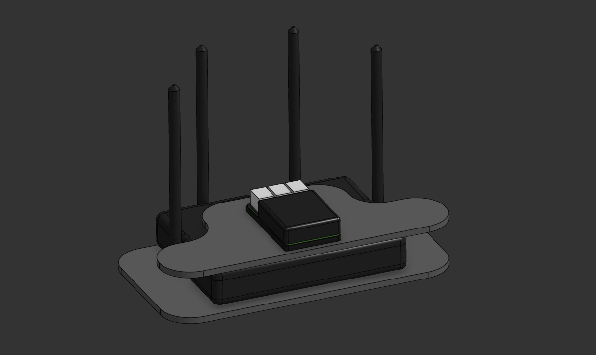

# Domotica
Maqueta educativa con servidor domótico.

    Maqueta de domótica
</figcaption>

El servidor:

<figcaption align="center"; style="margin-top: 10px; font-size: 14px; color: #555;">
    Servidor
</figcaption>

Puedes ver los diseños [aquí](<https://cad.onshape.com/documents/d6a8f2f76ae76a8239c98e7f/w/7032777c43a338df95c8073c/e/f056e302fcba7e00805ea264?renderMode=0&uiState=6a99ceef9c58c87a6aed63fd>)

## ToDo List

### La Maqueta / Servidor

* [Construir la maqueta](link)
* Instalar Servidor
  * En Raspberry
  * En Máquina Virtual
    * En Virtual Box
    * en VMWare
  * En una mini PC
  * Versión contenedor
* Acceso Remoto con Tailscale
* Definir espacios habitables

### Los dispositivos

* ESPHome
  * En Home Assistant OS
  * En ESPHome web
  * En VSCode
  * En Cursor con IA.
  * Crear un dispositivo genérico
    * Componentes básicos del dispositivo.
    * Entidades básicas del dispositivo.

### Tormenta de ideas

Implementación de protocolos.