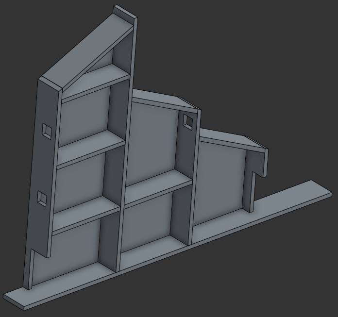
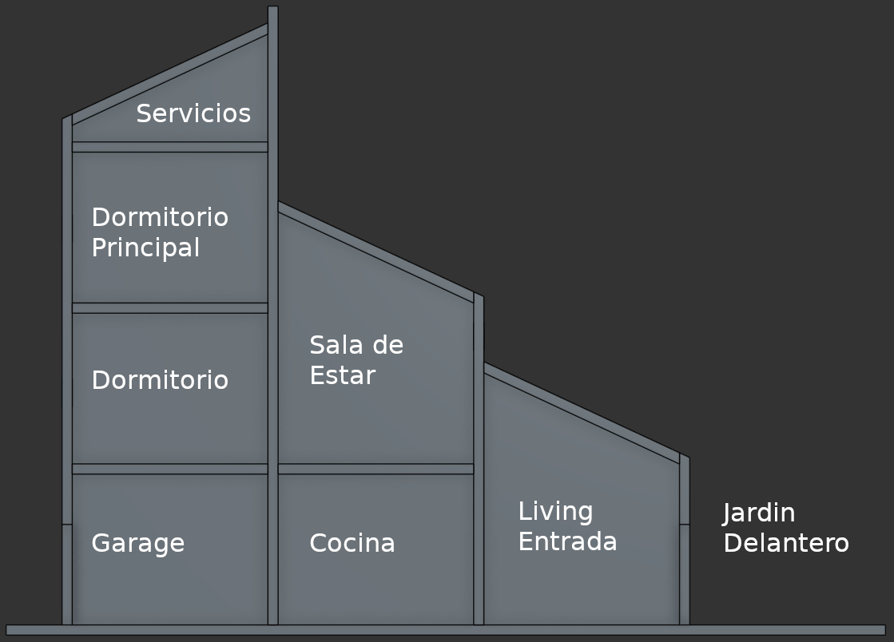

# La Maqueta

El propósito de la maqueta es probar uno a uno las posibilidades de configuración documentando cada paso para poder re implementar o extraer las partes que sean necesarias en cada caso.

## Estructura

La maqueta está construida en Melamina sobre MDF, tiene una disposición vertical con el objetivo de poder visualizar de la mejor manera posible los dispositivos.
para mantener el orden se presentan al frente los dispositivos y por detrás el cableado.

<p align="center">

<figcaption align="center"; style="margin-top: 10px; font-size: 14px; color: #555;">
    Maqueta de domótica
</figcaption>
</p>

Puedes ver los diseños [aquí](<https://cad.onshape.com/documents/d6a8f2f76ae76a8239c98e7f/w/7032777c43a338df95c8073c/e/f056e302fcba7e00805ea264?renderMode=0&uiState=6a99ceef9c58c87a6aed63fd>)

## Ambientes

La maqueta cuenta con tres plantas + 1 pequeño ambiente en la parte superior para servicios, básicamente es donde se coloca la llave termomagnética y disyuntor generales.

### Planta Baja

Está a nivel del piso, y en ella se encuentran:

* Living: Puerta Principal, es la entrada a la casa
* Cocina
* Garage
* jardín Delantero
* jardín trasero

### Primer Piso

* Sala de estar y TV
* Dormitorio

### Segundo Piso

* Dormitorio Principal
* Otras Estancias

Si bien no tienen un espacio físico se prevén a futuro:

### Servicios
Baterías de respaldo
Climatizador Central
Caldera
Servidor NAS

### Exterior

Generación Solar
Generación eólica
Termo tanque solar
Piscina y equipamientos respectivos
Tanque de Agua

<p align="center">

<figcaption align="center"; style="margin-top: 10px; font-size: 14px; color: #555;">
    Ambientes dentro de la maqueta
</figcaption>
</p>

## Arquitectura Documental y Política de Nombres

Tener en cuenta que la mayoría de los sistemas domóticos consideran 2 o más formas de nombrar a un dispositivo/entidad

### ID (id)
El id se utiliza a nivel interno en el código de ESPHome para que un componente pueda hacer referencia a otro (por ejemplo, en automatizaciones o lambdas).

Lo que SÍ puede tener:

* Letras minúsculas (a-z).
* Números (0-9).
* Guiones bajos (_).
* Debe comenzar obligatoriamente con una letra o un guion bajo.

Lo que NO puede tener:

* Letras mayúsculas (A-Z).
* Espacios en blanco.
* Caracteres especiales o símbolos (como -, @, $, *, etc.).
* Acentos o la letra ñ.
* No puede empezar con un número.
* No puede repetirse (debe ser único dentro de todo tu archivo de configuración).

### Friendly Name (friendly_name)

El friendly_name es el nombre "humano" y amigable que se mostrará en la interfaz de usuario, como en Home Assistant. Su formato es mucho más flexible.

Lo que SÍ puede tener:

* Cualquier carácter alfanumérico (letras mayúsculas, minúsculas y números).
* Espacios en blanco.
* Caracteres especiales y símbolos (como -, /, :, &, etc.).
* Letras con acentos (á, é, í...) y la letra ñ.
* Emojis (aunque se recomienda usarlos con moderación según la compatibilidad del sistema).

Lo que NO puede tener / No debe tener:

* Aunque a nivel de sintaxis YAML acepta casi cualquier texto, no debe estar vacío si decides declararlo.
* No se recomienda usar saltos de línea ni caracteres de control ocultos, ya que pueden romper la sincronización con Home Assistant.

### Etiquetas (Home Assistant)

Las etiquetas funcionan exactamente como los tags en cualquier otra plataforma digital. Permiten organizar de manera flexible el sistema domótico. A diferencia de las "Áreas" (que agrupan cosas por su espacio físico, como Salón o Cocina), las etiquetas agrupan elementos por conceptos, tecnologías o prioridades.

## Política ID´s

Es necesario separar tres conceptos:

`Lugar → Dispositivo → Entidad`

Por ejemplo:  

`Planta Baja - Living → Sensor de temperatura → Temperatura`

Se propone un nombre que refleje funcionalidad como por ejemplo:

`living_sensor_temperatura`  

evitando que el protocolo forme parte del nombre lógico.  

`living_esp32_temperatura_wifi`

De esta manera si se reemplaza el dispositivo o la tecnología, no cambia la estructura del sistema, sino la propia documentación de cada implementación.

### Lugar

Representa el espacio físico real de la casa donde se ubican los dispositivos. en el ejemplo de la maqueta, es un nombre compuesto entre la planta y el ambiente, se propone un sistema de código de 2 letras para la planta para evitar nombres demasiado extensos.

|Planta|Abreviatura|
|---|:---:|
|Planta Baja|p0|
|Primer Piso|p1|
|Segundo Piso|p2|
|Tercer Piso|p3|
|Jardín Frente|j0|
|Jardín Interno|j1|
|Exterior|ex|
|Servicios|sv|

Los ambientes se describen de manera completa o al menos una palabra o frase que permita identificar correctamente la habitación

|Planta|Ambiente|Nombre|
|---|---|---|
|Planta Baja|Living|p0_living|
|Segundo piso|Dormitorio Principal|p2_dormprin|
|jardín Interno|Pileta -Motor Filtro|j1_piletamotorf|

### Dispositivos y Entidades

#### Dispositivo

Un dispositivo representa el objeto físico o hardware real que se añade a la red domótica. Es un "contenedor" que puede contener una o varias entidades que pertenecen al mismo aparato.

#### Entidad

Una entidad es la unidad básica de información en Home Assistant. Representa un único componente, sensor, función o control específico de un aparato. Un solo objeto físico suele dividirse en múltiples entidades. también pueden ser información o datos de otros servicios, como por ejemplo una ubicación, la hora local, el horario de la puesta del sol, pronóstico de temperatura, etc.

Aquí los nombres son un poco menos intuitivos, en línea con la regla generar se prioriza función sobre la tecnología empleada:

|Dispositivo|Nombre|Entidades|
|---|---|---|
|Sensor en el living<br>que mide la calidad del aire|p0_living_aire|p0_living_aire_temperatura<br>p0_living_aire_humedad<br>p0_living_aire_co2<br>p0_living_aire_bateria<br>|

### Generalidades

* No utilizar tildes( ` ´ ) ni eñes (ñ)
* Los protocolos (ESPNow, WIFI, LORA) no forman parte de los nombres
* Los guiones `-` se usan en nombres de dispositivos, el uso de bajo guiones `_`puede generar problemas con los DNS, pero para id's de entidades son mandatorios, no se permite el uso de guiones.

https://esphome.io/guides/faq/

## Ficha técnica dispositivos

```text
Fecha:
2026-09-XX
Alumno:
XXXX

Estado:
ACTIVO

ID: DEV-PB-LIV-001
Nombre: Sensor ambiental Living

Ubicación: PB / Living

Descripción:
Medir temperatura y humedad.

Hardware:
ESP32-C3
BME280

Tecnología:
ESPHome

Comunicación:
Wi-Fi

Alimentación:
5 VDC

Entidades:
- temperatura
- humedad
- presión

Esquema eléctrico

Foto

codigo.yaml

Automatizaciones en las que participa.
```

Documentación de instalación
Documentación de configuración
Pruebas realizadas
Problemas encontrados
Solución aplicada


## La Maqueta / Servidor

* [Construir la maqueta](link)
* Instalar Servidor
  * En Raspberry
  * En Máquina Virtual
    * En Virtual Box
    * en VMWare
  * En una mini PC
  * Versión contenedor
* Acceso Remoto con Tailscale

