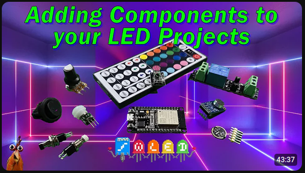
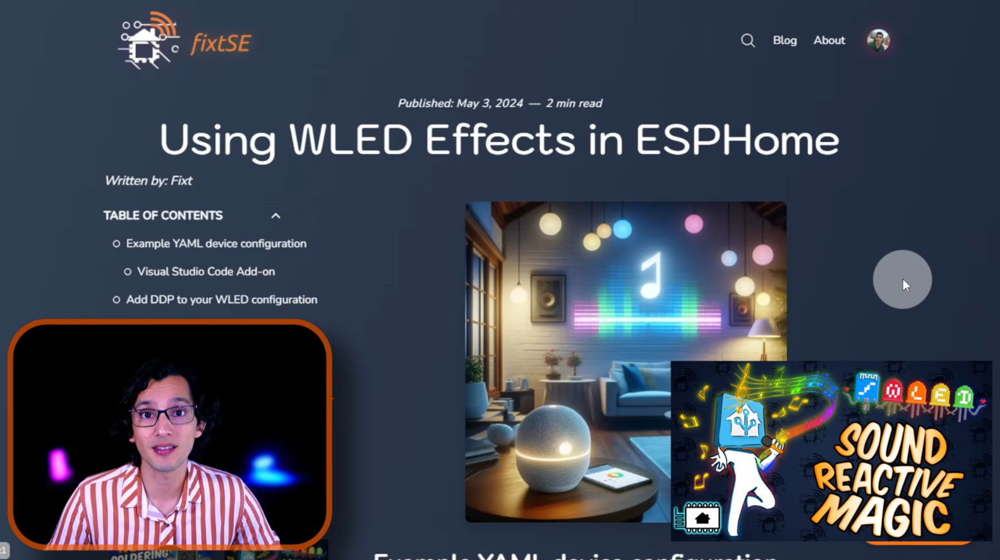

# NeoPixels

Entendemos por `NeoPixels` a tiras Led direccionable como la **2812B** o **WS2813**. Existen varios modelos en el mercado, se debe prestar especial atención a:

* La Alimentación: 5/12/24 VCC
* La densidad de leds (Leds por metro): 30/60/120/etc

## Comparativa de los modelos más populares

|Característica|WS2812B|WS2813|
|---|---|---|
|Líneas de datos|1 (Single Data)|2 (Data + Backup Data)|
|Frecuencia PWM|400 Hz|2000 Hz (2 kHz)|
|Pines / Cables|3 pines (+5V, GND, DIN)|4 pines (+5V, GND, DIN, BIN)|
|Si un LED se quema...|Toda la tira siguiente se apaga|El resto de la tira sigue funcionando|
|Componentes externos|Requiere resistencia y capacitor externos|Resistencia y capacitor integrados en el chip|
|Tiempo de Reset|50 µs|250 µs (evita reseteos accidentales)|

[Ampliar el significado de resistencia y capacitor externos](<ver>)

## Integrar tiras en Home Assistant

> [!CAUTION]
> Los videos y tutoriales son ejemplos de terceros que nos resultaron interesantes pero no tenemos responsabilidad sobre los resultados y sus consecuencias. Utilizar con precaución.

### W-led

[W-Led](<https://kno.wled.ge/>) es una implementación de un servidor web para el control de tiras `NeoPixel` (WS2812B, WS2811, SK6812), dentro del mismo controlador ESP32, posee muchas características favorables como:

* Biblioteca WS2812FX integrada con más de 100 efectos especiales
* Efectos de ruido FastLED y 50 paletas de colores
* Interfaz de usuario moderna con controles de color, efectos y segmentos
* Segmentos para asignar diferentes efectos y colores a distintas secciones de los LEDs
* Configuración a través de la red
* Capacidad de actualización completa del software vía OTA (HTTP) y protección por contraseña
* Soporte para efectos 2D

Antes de comenzar se aconseja revisar las [guías de cableado](<https://kno.wled.ge/basics/wiring-guides/>) en la web oficial.

Se pueden agregar muchos componentes externos como se puede ver en este video:

<p align="center">
<a href="https://youtu.be/1Qj1jJAam-8" target="_blank" rel="noopener noreferrer">
    
</a>
<figcaption align="center" style="margin-top: 10px; font-size: 14px; color: #555;">
    Mejora tus proyectos W-LED: Una guía para añadir componentes por ResinChem Tech
</figcaption>
</p>

Lal vez la característica más importante para el proyecto es que tiene [integración nativa](https://www.home-assistant.io/integrations/wled/) en Home-Assistant.

Si bien la interfaz web es muy completa y permite personalizar enormemente los segmentos y sus efectos, posee una desventaja y es la de no poder lanzar efectos directamente desde los pulsadores físicos conectados al ESP. Solo es posible un control on off y algunas características muy básicas, ademas la pulsación no es detectada por HA.

### ESP32 RMT LED Strip componente en ESPHome

Es posible configurar directamente los efectos como componente de ESPHome dentro del microcontrolador, permitiendo una total personalización de las funciones y automatizaciones de los componentes externos, pero cada efecto debe ser programado individualmente.

La pagina oficial del componente [ESP32 RMT LED Strip](<https://esphome.io/components/light/esp32_rmt_led_strip/>), se pueden encontrar configuraciones a adicionales a la básica:

```yaml
light:
  - platform: esp32_rmt_led_strip
    channel_colors: GRB
    pin: GPIOnn
    num_leds: 30
    chipset: ws2812
    name: "My Light"
    effects:
        .......
```

y algunos ejemplos de [Automatizaciones](<https://esphome.io/components/light/#light-automations>) y [efectos](<https://esphome.io/components/light/#light-effects>)

### Placa externa

Si lo que se busca en un mayor control de los efectos W-Led desde botones físicos, una alternativa eficaz pero poco eficiente, es trabajar con dos ESP32 individuales, uno con W-Led y el segundo con los botones y componentes externos configurados con ESPHome, utilizando Home Assistant para las automatizaciones y como lanzador de efectos en función de los botones presionados.

Es una alternativa muy básica pero que quizás valga la pena explorar.

### Protocolo DPP

El YouTuber [FixtSE](<https://www.youtube.com/@fixtse.>), propone una solución controlando w-led desde Home Assistant Utilizando el protocolo [DPP](<http://www.3waylabs.com/ddp/>) (Distributed Display Protocol) que es un protocolo de red de alta eficiencia diseñado para enviar datos sincronizados en tiempo real y comandos de mapeo de píxeles a sistemas de iluminación LED y pantallas RGB, para comunicar ESPHome con W-Led de manera más práctica y funcional.
Tutorial muy completo en su [blog](<https://fixtse.com/es/blog/esphome-wled-effects>) o en [YouTube](<https://youtu.be/Ap-WQ9-sDNY>)

<p align="center">
<a href="https://youtu.be/Ap-WQ9-sDNY" target="_blank" rel="noopener noreferrer">
    
</a>
<figcaption align="center" style="margin-top: 10px; font-size: 14px; color: #555;">
    Usa efectos de luz de W-LED en ESPHome por FixtSE
</figcaption>
</p>

Es una solución elegante aunque bastante compleja, pero vale la pena explorar.

> [!NOTE]
> La página oficial de ESPHome indica que  el componente [neopixelbus](https://esphome.io/components/light/neopixelbus/) sera deprecado en próximas ediciones, por que se sería interesante investigar esta solución con el componente [ESP32 RMT LED Strip](<https://esphome.io/components/light/esp32_rmt_led_strip/>)
